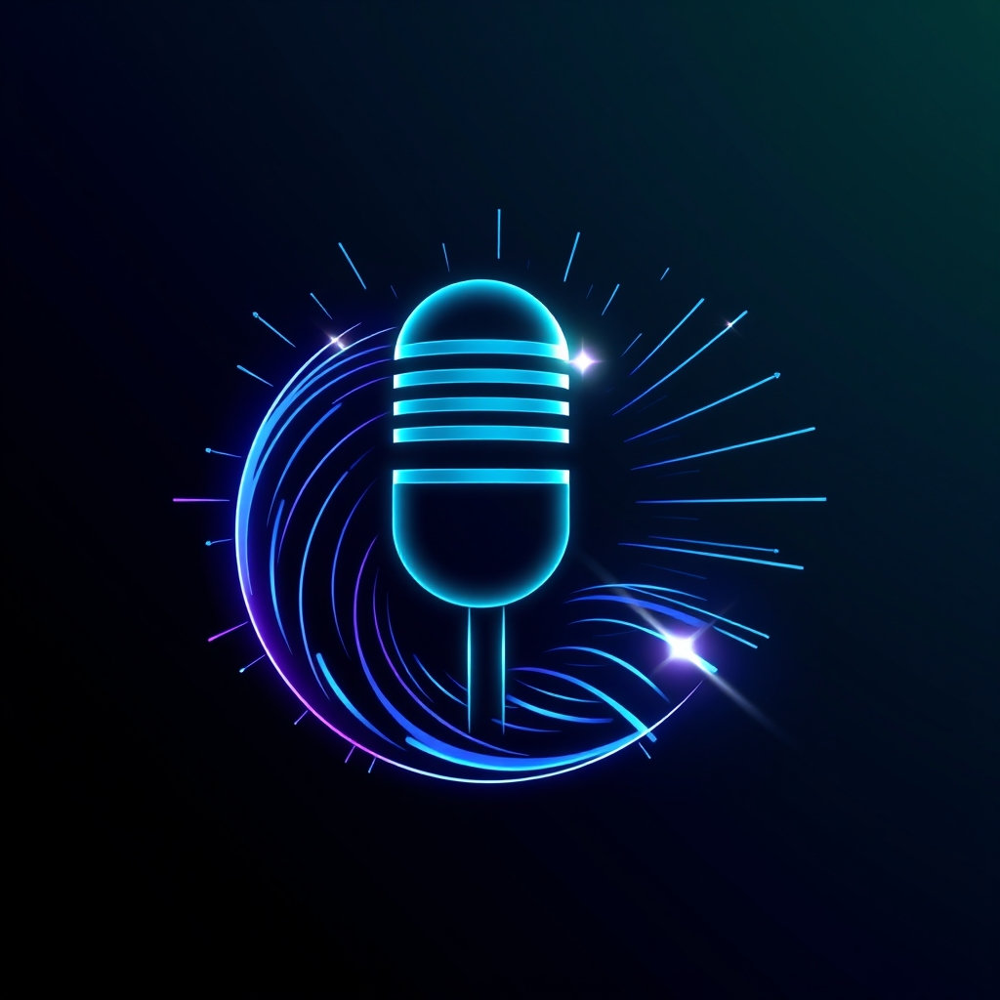

<p align="center">
  
</p>

# Speech to Text Translator

A modern web application that converts speech to text in real-time with support for multiple languages.

## Features

- Real-time speech-to-text conversion
- Support for 13 different languages
- Interactive audio visualization
- Automatic text copying
- Responsive design with dark mode
- Modern particle-based audio visualization

## Requirements

- Modern web browser (Chrome recommended)
- Microphone access
- JavaScript enabled

## Usage

1. Select your desired language from the dropdown
2. Click "Start Recording" to begin speech recognition
3. Speak into your microphone
4. Click "Stop Recording" to stop and automatically copy the text
5. The text will be copied to your clipboard automatically

## Development

```bash
# Clone the repository
git clone https://github.com/unlimitedbytes/speech-to-text-web.git

# Open the project directory
cd speech-to-text-web

# Open index.html in your browser
```

## Technologies Used

- HTML5
- TailwindCSS
- JavaScript (ES6+)
- Web Speech API
- Web Audio API
- Canvas API

## License

Copyright © 2025 UnlimitedBytes. All rights reserved.
